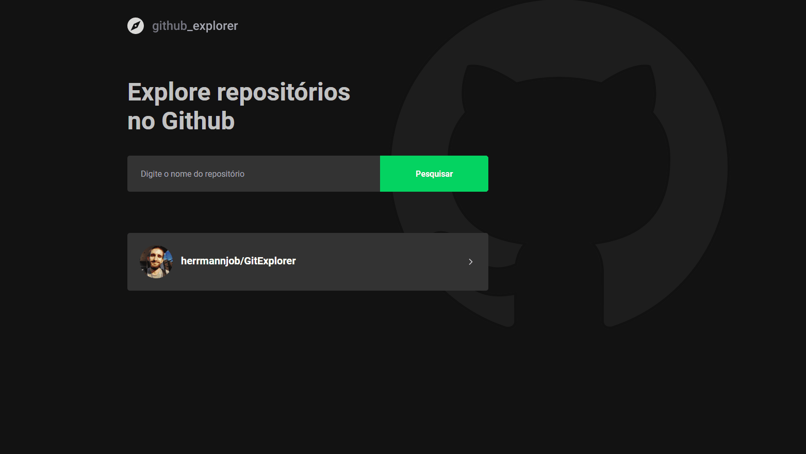
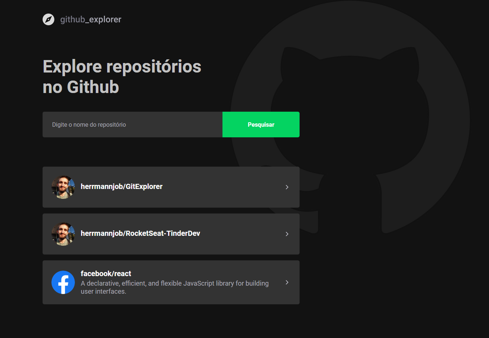
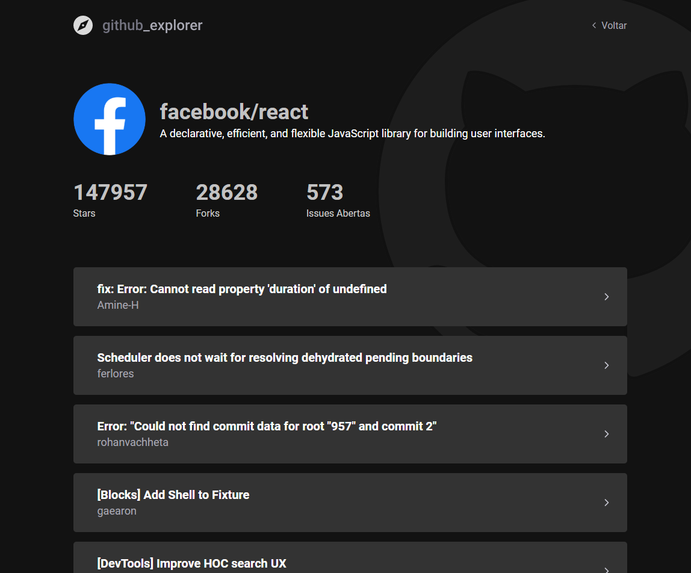


<h1 align="center">
   Github-Explorer
</h1>

 

  

## :camera: Demonstração

## :rocket: Tecnologias

Esse projeto foi desenvolvido com as seguintes tecnologias:

✔️React

✔️Typescript

✔️LocalStorage

✔️Styled-components

✔️React-hooks

✔️Axios

✔️Eslint

✔️Prettier

## 💻 Projeto

Github explorar é uma aplicação feita utilizando React + typescript, que consome a API do Github, para adicionar repositórios, ver alguns dados como Issues,forks,stars.

## ⚙ Configuração

1- Para instalar as dependências:
> yarn

2- Para iniciar a aplicação:
> yarn start

---

